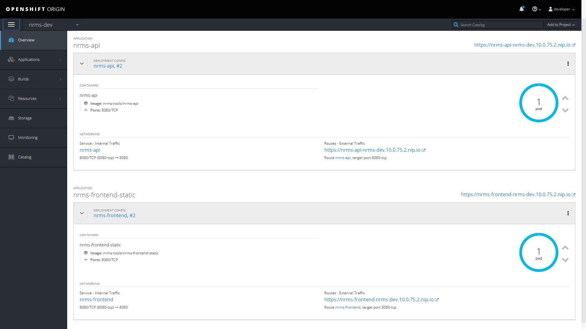

# Running on OpenShift

This project uses the scripts found in [openshift-project-tools](https://github.com/BCDevOps/openshift-project-tools) to setup and maintain OpenShift environments (both local and hosted).  Refer to the [OpenShift Scripts](https://github.com/BCDevOps/openshift-project-tools/blob/master/bin/README.md) documentation for details.

**IMPORTANT:  These scripts are designed to be run on the command line (using Git Bash for example) in the root `./openshift` directory of your project.**

## Table of Contents

- [Before you begin](#before-you-begin)
- [Scenario #1 - Running on a Local OpenShift Cluster](#scenario-1---running-on-a-local-openshift-cluster)
- [Scenario #2 - Running on the BC Government Pathfinder OpenShift instance](#scenario-2---running-on-the-bc-government-pathfinder-openshift-instance)
- [Advanced Stuff](#advanced-stuff)

## Before you begin...

### Working with OpenShift

When working with OpenShift, commands are typically issued against the **server-project** pair to which you are currently connected. Therefore, when you are working with multiple servers (local, and remote for instance) you should always be aware of your current context so you don't inadvertently issue a command against the wrong server and project.

**NOTE:**  Although you can login to more than one server at a time it's always a good idea to completely logout of one server before working on another.

The automation scripts provided by [openshift-project-tools](https://github.com/BCDevOps/openshift-project-tools) will hide some of these details from you, in that they perform project context switching automatically. However, what they don't do is provide server context switching. They assume you are aware of your server context and you have logged into the correct server.

Here are some useful commands to help you determine your current context:

- `oc whoami -c`  *// Lists your current server and user context*
- `oc project`  *// Lists your current project context*
- `oc project [NAME]`  *// Switch to a different project context*
- `oc projects` *// Lists the projects available to you on the current server*

### Project Set Initialization

Before you can run your applications in the Pathfinder (BC Gov) instance of OpenShift, the DevOps team will have to provision a set of OpenShift projects to house your CI/CD tooling (e.g. build pipeline, functional tests, etc.) as well as deployment environments. Typically this set consists of **tools**, **dev**, **test**, and **prod** projects. Collectively, this is referred to as a "Project Set". 

**NOTE:**  "Project Set" is a fabricated term used to describe two or more OpenShift projects that relate to the same app/product. There is no such construct in OpenShift or Kubernetes.

### Naming Conventions

The projects follow a naming convention similar to "{team_name}-{product_name}-{environment_name}". For example, "gcpe-news-tools" would be the "tools" environment for the news product, owned by the GCPE team. 

The 'tools' project will house various *build configurations*, or **`BuildConfig`** for your app. It will also host a Jenkins instance that will be responsible for promoting application images across your deployment environments (e.g. "dev", "test" and "prod").  Image promotion is achieved in OpenShift via *image stream tags*, or **`ImageStreamTag`**.

### Background Reading and Resources

The commands and instructions in the next sections assume a moderate to advanced knowledge of OpenShift. There are two good PDFs available from Red Hat and O'Reilly:

* [OpenShift for Developers](https://www.openshift.com/for-developers/)
* [DevOps with OpenShift](https://www.openshift.com/devops-with-openshift/)

* OpenShift Developer Guide:
  * [What Is a Build?](https://docs.openshift.com/container-platform/3.9/dev_guide/builds/index.html#dev-guide-what-is-a-build)
  * [What Is a Deployment?](https://docs.openshift.com/container-platform/3.9/dev_guide/deployments/how_deployments_work.html#what-is-a-deployment)
  * [What Is an Image Stream?](https://docs.openshift.com/container-platform/3.9/architecture/core_concepts/builds_and_image_streams.html#image-streams)

## Scenario #1 - Running on a Local OpenShift Cluster

At times running in a local cluster is a little different than running in the production (Pathfinder) cluster.

Differences can include:
* Resource settings.
* Available image runtimes.
* Source repositories (such as your development repo).
* Etc.

This section is intended for application developers, and provides instructions for setting up and configuring a workstation to develop and deploy applications in a Local OpenShift Cluster environment. The following procedure uses the **`oc cluster up`** approach to provision an OpenShift Cluster directly in [Docker](https://www.docker.com/get-started).

### Before you begin...

**IMPORTANT!**  **You must increase the memory available to Docker. Not doing so will lead to failed builds and crashes in your local OpenShift cluster.**

Docker uses only **2 GB** of memory by default, which is not enough to run OpenShift. If you experience hangs when trying to run builds and deployments in OpenShift, you should do the following:

On Windows;

1. Open Docker > **Settings** > **Advanced**.
2. Increase the amount of memory available to Docker to **6 GB** (or more).
3. You should also increase the Swap space to **2 GB** (or more).
4. Click **Apply**.

### Getting Started Locally

1. Install OpenShift [command line tools](https://github.com/openshift/origin/releases/) (CLI)
2. Change into the top level **`openshift`** folder
3. Create **`settings.local.sh`** file
4. Provision your local OpenShift cluster (**`oc cluster up`**)
5. Login to local cluster with the command-line **`oc`** tools
6. Run `generateLocalProjects.sh` to generate a local set of projects (e.g. dev, test, prod and tools)
7. Run `initOSProjects.sh` to initialize your projects
8. Run `genParams.sh -f` to generate settings files
9. Run `genParams.sh -f -l` to generate settings files for your local cluster
10. Review generated settings files, make edits as needed
11. Run `genBuilds.sh -l` to generate the *build configurations*, or **`BuildConfig`** for your app
12. Run `genDepls.sh -l -e dev` to generate the *deployment configurations*, or **`DeploymentConfig`** for your DEV environment
    * Run `genDepls.sh -l -e test` for your TEST environment
    * Run `genDepls.sh -l -e prod` for your PROD environment
13. Run `updateRoutes.sh -e dev` to fix the routes (server URLs) on your DEV environment
    * Run `updateRoutes.sh -e test` to fix the routes (server URLs) on your TEST environment
    * Run `updateRoutes.sh -e prod` to fix the routes (server URLs) on your PROD environment

### 1. Install OpenShift command line tools (CLI)

1. Download OpenShift [command line tools](https://github.com/openshift/origin/releases/).
2. Unzip the downloaded file.
3. Add `oc` to your PATH.

The CLI is now available using the `oc` command:

```bash
oc <command>
```

**WINDOWS USERS:**  Ensure that you do not have a linux "oc" binary on your path if using Git Bash on a Windows PC to run the scripts.  A windows "oc.exe" binary will work fine.

### 2. Change into the top level OpenShift folder

```bash
cd /[Path-To-Working-Copy]/openshift
```

### 3. Settings.local.sh

To target a different repo and branch, create a `settings.local.sh` file in your project top level **`openshift`** directory. Within this file, override the GIT parameters.

**For Example:**

```bash
export GIT_URI="https://github.com/bcgov/gcpe-news-dashboard.git"
export GIT_REF="openshift-updates"  <-- we are targeting a different branch here!
```

### 4. Provision your local OpenShift Cluster

**REMEMBER:**  All of the commands listed in the following sections must be run from the root **`openshift`** directory of your project's source code.

*You must have the OpenShift CLI installed on your system for the scripts to work*

Run;

```bash
oc-cluster-up.sh
```

, and wait for the cluster to start up...

```
Using Docker shared volumes for OpenShift volumes
Using 10.0.75.2 as the server IP
Starting OpenShift using openshift/origin:v4.5.0 ...
OpenShift server started.

The server is accessible via web console at:
    https://10.0.75.2:8443
```

This will start your local OpenShift cluster using persistence and Docker containers so your configuration is preserved across restarts.

By default, the OpenShift cluster will be setup with a routing suffix that ends in **`nip.io`**. This is to allow dynamic host names to be created for routes; e.g. http://your-app-dev.10.0.75.2.nip.io/

*To cleanly shutdown your local cluster use **`oc-cluster-down.sh`***

### 5. Login to your local OpenShift instance

**With the command-line (`oc`) tools:**

1. Copy the command line login string from https://10.0.75.2:8443/console/command-line

   It will should be like:

   ```bash
   oc login https://10.0.75.2:8443 --token=<hidden>
   ```

2. Paste the login string into a terminal session.

3. You are now authenticated against OpenShift and will be able to execute `oc <command>`.

**NOTE:**  If you are asked for credentials use `developer` as both the username and password.

**NOTE:**  `oc -h` provides a summary of available commands.

### 6. Generate local set of projects (dev, test, prod and tools)

*This command will only work on a LOCAL server context. It will fail if you are logged into a remote server.*

```bash
generateLocalProjects.sh
```

This will generate four OpenShift projects; **tools**, **dev**, **test** and **prod**. The "tools" project is used for builds and DevOps activities; while the "dev", "test", and "prod" projects will host your deployment environments.

##### 6.1 Resetting your local OpenShift cluster

To reset your local environments (i.e. start over) run;

```bash
# Caution - your OpenShift projects will be deleted!
generateLocalProjects.sh -D
```

**WARNING:**  This command will PERMANENTLY delete all your local OpenShift projects! Use with care.

### 7. Initialize your projects

Run;

```bash
initOSProjects.sh
```

This will initialize the projects with permissions that allow images from one project (tools) to be deployed into another project (dev, test, prod). For production environments will also ensure the persistent storage services exist.

**NOTE:**  When running on your local cluster, you will see some messages - *"No resources found"*. These can be safely ignored.

### 8. Generate settings files

Run;

```bash
# -f switch means "force" (i.e. overwrite any existing config files)
genParams.sh -f
```

**NOTE:**  Generated settings files (**`*.param`**) for the production instance of OpenShift should be committed to Git

### 9. Generate extra settings files - for your local cluster

When you are working with a local cluster you must generate a set of local "param" files.

Run;

```bash
# -f switch means "force" (i.e. overwrite any existing config files)
# -l switch means "local" params
genParams.sh -f -l
```

This will generate local settings files for all your build configurations, deployment configurations, and Jenkins pipelines. The local settings will ensure that the CPU and Memory resources (limits and requests) specified in your OpenShift templates are adjusted accordingly to avoid builds and deployments from hanging due to lack of sufficient resources in your local workstation.

**NOTE:**  These settings will be specific to your local OpenShift cluster and will override the production-ready values when running `genBuilds.sh` and `genDepls.sh` scripts with the `-l` switch (more on that below).

**NOTE:**  Generated local param files (**`*.local.param`**) are ignored by Git, so you don't need to worry about accidentally committing them to the repository.

### 10. Review generated param files

Before progressing through this guide it is a good idea that you review the generated **`*.param`** files and make any edits as needed.

**IMPORTANT:**  Before you continue, you MUST provide a value for NAME in the "*.pipeline.param" files.

- Set NAME=news-dashboard in *[Working-Copy]/Jenkinsfile.pipeline.param*
- Set NAME=news-dashboard in *[Working-Copy]/openshift/Jenkinsfile.pipeline.local.param*

### 11. Generate the Build Configurations for your app

This script will generate the build configurations into the `tools` project. Additionally, if your project contains any Jenkins pipelines (i.e. a Jenkinsfile), then a new Jenkins instance will be created in the `tools` project automatically. OpenShift will automatically wire the Jenkins pipelines to Jenkins projects within Jenkins.

Run;

```bash
# -l switch means "local"
genBuilds.sh -l
```

:warning: **IMPORTANT!**  The script will stop mid-way through. 

Ensure all builds are complete in the **`tools`** project before proceeding:

1. Login to your local cluster.
2. Go to "Tools" project > **Builds** > **Builds**.
3. Wait for all the build to complete (i.e. status must be ":white_check_mark: Complete").
4. Go back to the command line, press any key to proceed.

### 12. Generate the Deployment Configurations for your app

This script will generate the deployment configurations for the selected environment; `dev`, `test`, and `prod`.

Run;

```bash
# genDepls.sh -l -e <EnvironmentName, one of [dev|test|prod]>
genDepls.sh -l -e dev
genDepls.sh -l -e test
genDepls.sh -l -e prod
```

, and follow the instructions.

:warning: **IMPORTANT!**  Verify that the deployments were executed successfully

1. Login to your local cluster.
2. Switch to your "DEV" project (from the projects drop-down).
3. Click **Applications** > **Deployments**.
4. Wait for all deployments to complete (i.e. status must be ACTIVE).
5. Go back to the command line, press any key to proceed.



### 13. Fix the routes (server URLs) - for local instances only

##### Why do I need to do this?

The current version of the automated OpenShift scripts ([openshift-project-tools](https://github.com/BCDevOps/openshift-project-tools)) use a hardcoded URL when creating the routes to your application deployment environments.

All routes created by these scripts are explicitly defined for the Pathfinder (BC Government) instance of OpenShift; i.e. your app URL (in dev) is defined as https://news-dashboard-05e933-dev.pathfinder.gov.bc.ca/ instead of pointing to your local instance.

Run;

```bash
# updateRoutes.sh -e <EnvironmentName, one of [dev|test|prod]>
updateRoutes.sh -e dev
updateRoutes.sh -e test
updateRoutes.sh -e prod
```

This will fix the routes in your local deployment environments (dev, test, prod). The script will re-point your routes (URLs) to your local OpenShift cluster.

Before:

https://news-dashboard-05e933-dev.pathfinder.gov.bc.ca/

After:

https://news-dashboard-05e933-dev.10.0.75.2.nip.io/

------

:tada: *Congratulations! Now you should have a fully functioning app running on your local OpenShift instance.* :tada:

## Scenario #2 - Running on the BC Government Pathfinder OpenShift instance

This section includes information on how to get your application up and running in the BC Government Pathfinder OpenShift instance:

### Getting Started

1. Install OpenShift [command line tools](https://github.com/openshift/origin/releases/) (CLI)
2. Change into the top level **`openshift`** folder
3. Create **`settings.sh`** file
4. Login to Pathfinder cluster with the command-line **`oc`** tools
5. Run `initOSProjects.sh` to initialize your projects (e.g. dev, test, prod and tools)
6. Run `genParams.sh` to generate settings files
7. Review generated settings files, make edits as needed
8. Run `genBuilds.sh` to generate the *build configurations*, or **`BuildConfig`** for your app
9. Run `genDepls.sh -e dev` to generate the *deployment configurations*, or **`DeploymentConfig`** for your DEV environment
   * Run `genDepls.sh -e test` for your TEST environment
   * Run `genDepls.sh -e prod` for your PROD environment

**NOTE:**  If you are looking for information on how to run your application in a local OpenShift Cluster, go to the next section (Scenario 2). It contains additional steps required for local OpenShift installations.

### 1. Install OpenShift command line tools (CLI)

1. Download OpenShift [command line tools](https://github.com/openshift/origin/releases/).
2. Unzip the downloaded file.
3. Add `oc` to your PATH.

The CLI is now available using the `oc` command:

```bash
oc <command>
```

**WINDOWS USERS:**  Ensure that you do not have a linux "oc" binary on your path if using Git Bash on a Windows PC to run the scripts.  A windows "oc.exe" binary will work fine.

### 2. Change into the top level OpenShift folder

```bash
cd /[Path-To-Working-Copy]/openshift
```

### 3. Settings.sh

You will need to include a `settings.sh` file in your top level **`./openshift`** directory. This file will contain your project-specific settings.

At a minimum this file should contain definitions for your `PROJECT_NAMESPACE`, `GIT_URI`, and `GIT_REF` all of which should be setup to be overridable.

**For Example:**

```bash
export PROJECT_NAMESPACE=${PROJECT_NAMESPACE:-05e933}
export GIT_URI=${GIT_URI:-"https://github.com/bcgov/gcpe-news-dashboard.git"}
export GIT_REF=${GIT_REF:-"develop"}
```

### 4. Login to Pathfinder

**REMEMBER:**  All of the commands listed in the following sections must be run from the root **`openshift`** directory of your project's source code.

*You must have the OpenShift CLI installed on your system for the scripts to work*

**With the command-line (`oc`) tools:**

1. Copy the command line login string from <https://console.pathfinder.gov.bc.ca:8443/console/command-line>

   It will should be like:

   ```bash
   oc login https://console.pathfinder.gov.bc.ca:8443 --token=<hidden>
   ```

2. Paste the login string into a terminal session.

3. You are now authenticated against OpenShift and will be able to execute `oc <command>`.

**NOTE:**  `oc -h` provides a summary of available commands.

### 5. Initialize your projects

Run;

```bash
initOSProjects.sh
```

This will initialize the projects with permissions that allow images from one project (tools) to be deployed into another project (dev, test, prod). For production environments will also ensure that persistent storage services exist.

**REMEMBER!**  These instructions are for the production cluster (Pathfinder). To run OpenShift locally refer to [Scenario #1](#scenario-#1---running-on-a-local-openshift-cluster).

### 6. Generate settings files

Run;

```bash
# -f switch means "force" (i.e. overwrite any existing config files)
genParams.sh -f
```

**NOTE:**  Generated settings files (**`*.param`**) for the production instance of OpenShift should be committed to Git

### 7. Review generated param files

Before progressing through this guide it is a good idea that you review the generated **`*.param`** files and make any edits as needed.

**IMPORTANT:**  Before you continue, you MUST provide a value for NAME in the "*.pipeline.param" files.

- Set NAME=news-dashboard in *[Working-Copy]/Jenkinsfile.pipeline.param*
- Set NAME=news-dashboard in *[Working-Copy]/openshift/Jenkinsfile.pipeline.local.param*

### 8. Generate the Build Configurations for your app

Run;

```bash
# genBuilds.sh -h to get advanced usage information...
genBuilds.sh
```

**IMPORTANT!**  The script will stop mid-way through. Ensure all builds are complete in the **`tools`** project before proceeding.

**REMEMBER!**  These instructions are for the production cluster (Pathfinder). To run OpenShift locally refer to [Scenario #1](#scenario-#1---running-on-a-local-openshift-cluster).

This script will generate the build configurations into the `tools` project. Additionally, if your project contains any Jenkins pipelines (i.e. a Jenkinsfile), then a new Jenkins instance will be created in the `tools` project automatically. OpenShift will automatically wire the Jenkins pipelines to Jenkins projects within Jenkins.

### 9. Generate the Deployment Configurations for your app

Run;

```bash
# genDepls.sh -e <EnvironmentName, one of [dev|test|prod]>
# genDepls.sh -h to get advanced usage information.
genDepls.sh -e dev
genDepls.sh -e test
genDepls.sh -e prod
```

**REMEMBER!**  These instructions are for the production cluster (Pathfinder). To run OpenShift locally refer to [Scenario #1](#scenario-#1---running-on-a-local-openshift-cluster).

This script will generate the deployment configurations for the selected environment; `dev`, `test`, and `prod`.

-----

:tada: *Congratulations! Now you should have a fully functioning app running on OpenShift.* :tada:

## Advanced Stuff

### Add Build Pipeline Webhook(s) to GitHub

Once you have a working OpenShift cluster, you might want to connect your build pipeline to GitHub (via webhooks) so that when there's a new commit (or pull request) pushed to your repo, it triggers a new build in OpenShift:

1. Log into the web console and switch to the project: "Your App (tools)"
2. Select Builds => Pipelines => [name-of-your-build-pipeline] => Configuration
3. Under the Triggers section, copy the GitHub Webhook URL

[TODO: screenshot]

4. Go to your repository settings on GitHub, and add the webhook URL under "Webhooks"

   * Payload URL = The URL you copied from OpenShift

   * Content type = application/json

   * Secret = Leave Blank

   * Just push the event

   * Active
